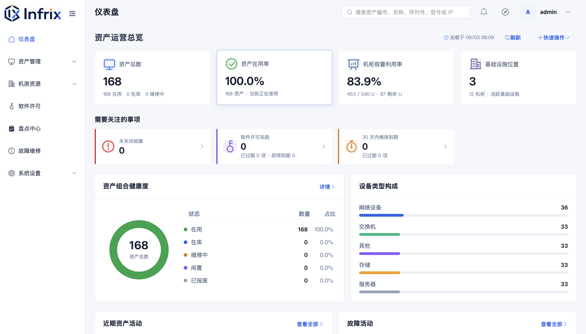

# Infrix

[中文 README](README.zh-CN.md) · [Rocky Linux installation](docs/INSTALL_VM.md)

Infrix is an IT asset management platform for infrastructure teams. It brings
asset records, locations, maintenance, licenses, inventory, spare parts,
notifications, and audit history into one application.

## Product preview

<p align="center">
  
</p>

## Quick start

The supported automatic installation target is Rocky Linux 9.x. From the
project root or an extracted release package, run:

```bash
sudo bash deploy/install.sh
```

On a new host, the installer asks for the address, database mode, and HTTPS
mode, then saves the production configuration and guides you through the first
administrator. On an existing host, the same command reuses its configuration
and performs an in-place upgrade.

For a release package with prebuilt frontend assets:

```bash
mkdir /tmp/infrix-release
tar -xzf infrix-release.tar.gz -C /tmp/infrix-release
cd /tmp/infrix-release
sudo bash deploy/install.sh
```

To synchronize source to a remote sudo-capable host:

```bash
./deploy-to-remote.sh <ssh-target>
```

The remote helper supports `--config /absolute/server/path` and
`--non-interactive`. See the installation documents before using it on a
production host.

## Features

- Asset records, imports, exports, custom fields, tags, lifecycle data, and
  optional assigned people.
- Data centers, server rooms, racks, U-position allocation, and capacity views.
- Fault registration, repair workflows, costs, and repair history.
- Software licenses, inventory tasks, spare parts, stock, and transactions.
- User accounts, people, departments, roles, LDAP/Active Directory integration,
  and audit logs.
- System settings for localization, security, SMTP, notifications, branding,
  and maintenance.

## Documentation

- [Rocky Linux automatic installation and upgrade](docs/INSTALL_VM.md)
- [Installer workflow, recovery, release packages, and HTTPS diagnosis](docs/INSTALLER_WORKFLOW.md)
- [Manual deployment for other Linux distributions](docs/MANUAL_DEPLOYMENT.md)
- [Production environment template](deploy/infrix.env.example)
- [Change log](CHANGELOG.md)

The Chinese documentation is available from [README.zh-CN.md](README.zh-CN.md),
[中文 Rocky 安装文档](docs/DEPLOYMENT.zh-CN.md),
[中文安装流程说明](docs/INSTALLER_WORKFLOW.zh-CN.md), and
[中文手工部署文档](docs/MANUAL_DEPLOYMENT.zh-CN.md)。

## Release note

The `v0.1.0` source tree uses a clean fresh-install migration baseline. The
release installation and upgrade rules, including the restriction on
pre-release development databases, are documented in the installation guides.
